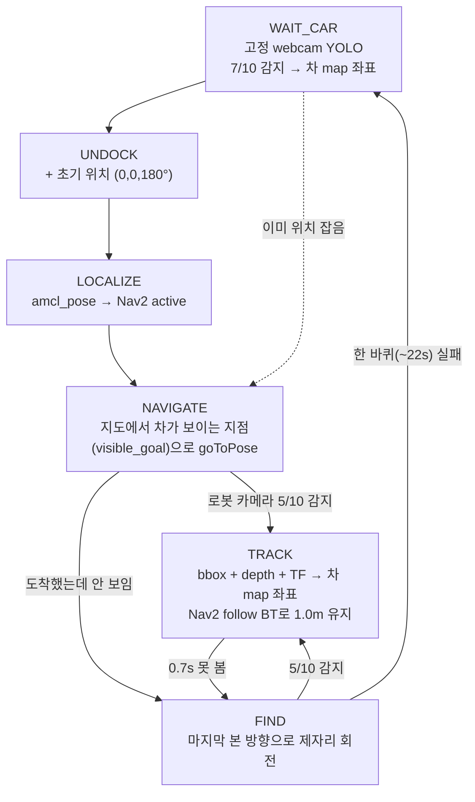
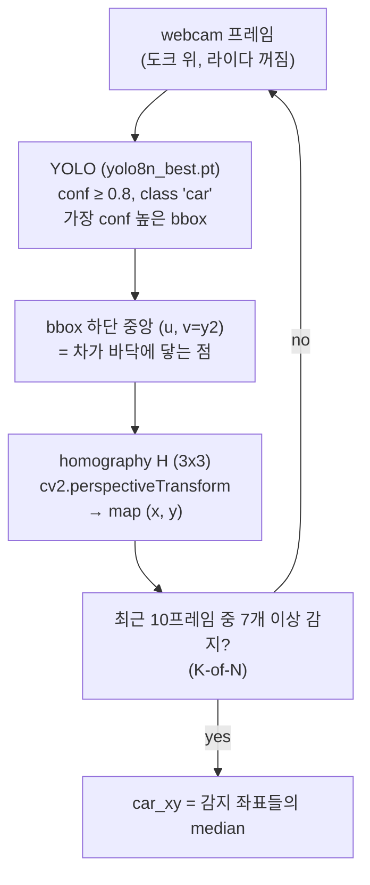
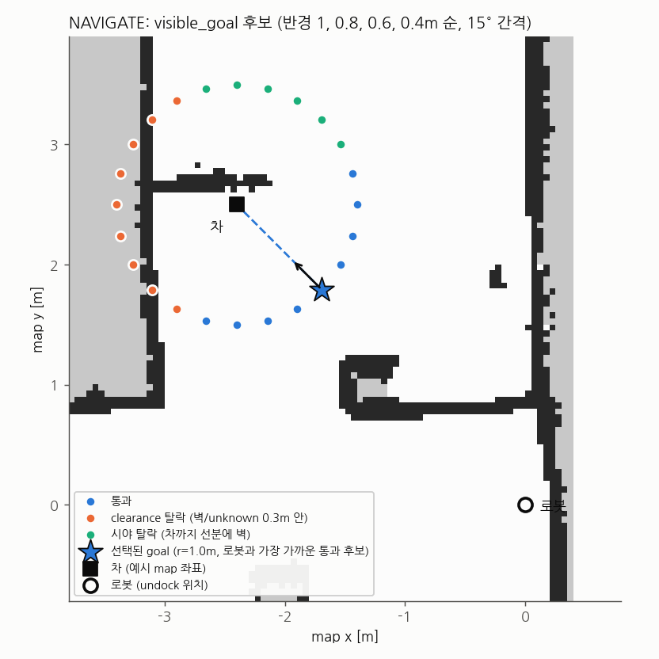
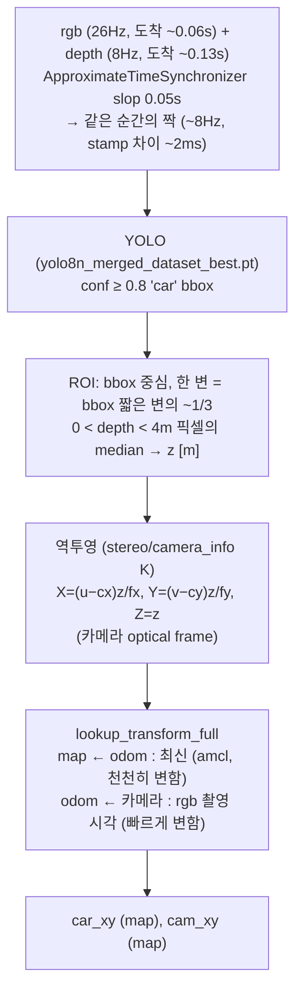
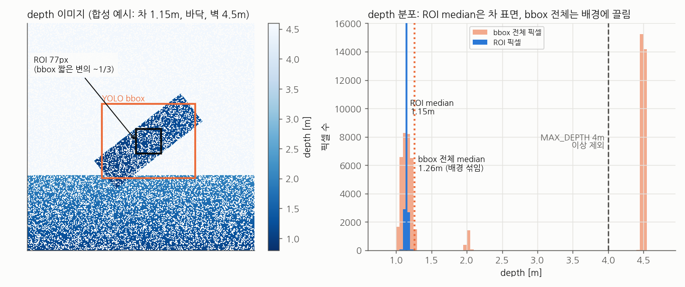
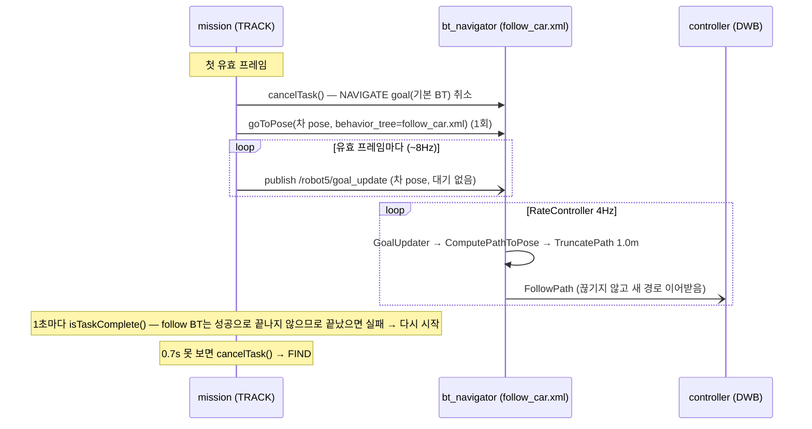
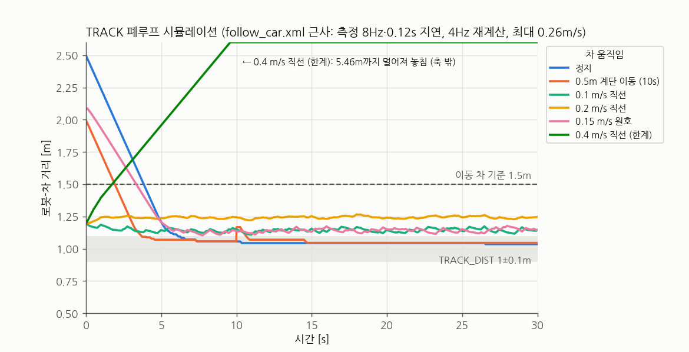

# 알고리즘 정리

`src/mini_project/mini_project/mission.py` 기준 (브랜치 `feature/hhj-track-gotopose`, 2026-10-07).
토픽·자료형·변수 표는 [architecture.md](architecture.md), 실행 방법과 진행 단계는 [plan.md](plan.md).
그림은 `python3 docs/img/make_figures.py`로 다시 만든다 (실제 코드 함수를 호출).

## 1. 한눈에 보기



| 단계 | 입력 | 로봇을 움직이는 것 | 핵심 아이디어 |
|---|---|---|---|
| WAIT_CAR | 고정 webcam | 없음 | 바닥 homography 하나로 픽셀 → map (카메라 내부 파라미터·TF 불필요) |
| NAVIGATE | 차 map 좌표 + 정적 지도 | Nav2 (기본 BT) | 벽 너머가 아닌, 차가 **보이는** 지점을 goal로 |
| TRACK | 로봇 rgb + depth + TF | Nav2 (follow BT) | action은 1회, 차 위치는 토픽으로 계속 갱신 |
| FIND | 로봇 rgb | cmd_vel 회전 | 놓친 방향으로 먼저 돈다 |

## 2. WAIT_CAR: webcam → 차 map 좌표



- 차는 항상 바닥 위 → 바닥 평면 하나에 대한 homography면 충분. H는 `webcam_calib`로 로봇을 기준점에 세워 amcl 좌표와 짝지어 구한다.
- bbox **중심**이 아니라 **하단 중앙**: 중심은 차 높이만큼 멀리 찍힌다.
- median: 튀는 프레임 제거. K-of-N: 순간 오검출로 출발하지 않도록.
- 한계: 렌즈 왜곡 무시, 실기에서 로봇 카메라 측정과 0.2~0.5m 차이가 관찰됨 → homography 재검증 필요 (9장).

## 3. NAVIGATE: 차가 보이는 지점 고르기 (`visible_goal`)



```
for r in (1.0, 0.8, 0.6, 0.4):              # 먼 것부터 (TRACK_DIST가 첫 반경)
    for a in 0°, 15°, ..., 345°:             # 차 주위 원 위 후보 24개
        p = car + r·(cos a, sin a)
        ① clearance: p 주변 0.3m 정사각형 안에 벽/unknown 셀이 있으면 탈락   (로봇 반경 0.19 + 여유)
        ② 시야: p → 차 선분을 셀 크기 절반 간격으로 샘플, 벽(≥50) 셀이 있으면 탈락
    통과 후보가 있으면 → 로봇과 직선 거리가 가장 가까운 후보, yaw = 차를 바라봄, 종료
없으면 → 로봇-차 직선 위 APPROACH_DIST(0.5m) 지점 (straight)
```

- 지도: `/robot5/map` (`OccupancyGrid`, 0 빈칸 / 100 벽 / -1 unknown). unknown은 서 있을 곳으로는 탈락, 시야는 막지 않음으로 본다.
- 그림 예시(차 (-2.4, 2.5)): 1.0m 원 24개 중 clearance 탈락 9, 시야 탈락 6(차 위쪽 벽 너머), 통과 9 → 로봇에 가장 가까운 (-1.69, 1.79), 135°.
- 왜: 처음엔 "로봇-차 직선 위 1.4m"였는데 goal이 벽 너머에 찍혀 **차가 안 보인 채 도착 → FIND → WAIT_CAR 반복**이 실측됐다.
- 한계: 정적 지도만 봄(사람·상자·차 자체는 모름). 직선 거리로 골라서 벽 반대편 후보가 경로상 더 멀 수 있음 (`nav.getPath()` 경로 길이로 개선 가능).

## 4. TRACK 인식: bbox → 차 map 좌표





- **ROI median**: 비스듬히 선 길쭉한 차라도 bbox 중심 1/3 영역은 차 몸통 → median이 차 표면(예시 1.15m). bbox 전체를 쓰면 바닥·벽이 섞여 1.26m로 끌린다. 4m 이상(먼 벽)은 아예 제외.
- depth는 차 **중심이 아니라 가까운 표면**까지 거리: 길이 L·폭 W 차가 θ로 서 있으면 중심보다 `min(W/2cosθ, L/2sinθ)` 짧다 (40×20cm, 45° → 0.14m). goal 거리 1.0m에 비해 작아 보정하지 않음.
- **K**: rgb와 depth가 704x704로 align되어 있고 depth 메시지 frame_id(`oakd_rgb_camera_optical_frame`)와 같은 기준인 `stereo/camera_info`의 K.
- **TF 시각 분리**가 핵심 (5장 표의 ①②).

## 5. TRACK 제어: Nav2 동적 추종



- goal은 **차 위치 자체**, 1.0m 앞에서 멈추는 건 BT의 `TruncatePath`(경로 끝 1.0m 잘라냄) = `TRACK_DIST`.
- 도착 판정 `xy_goal_tolerance` 0.1m (`config/nav2.yaml`), 후진 없음, 최대 0.26 m/s.

## 6. FIND

- 마지막으로 본 bbox가 화면 왼쪽이면 왼쪽(+)으로, 오른쪽이면 오른쪽으로 `FIND_ANG` 0.3 rad/s 제자리 회전 (cmd_vel).
- 들어갈 때 Nav2 goal 취소(cmd_vel과 겹치지 않게), TRACK으로 돌아갈 때 정지 명령(회전 잔여 방지).
- 한 바퀴(2π/0.3 + 1 ≈ 22s) 안에 5/10 감지가 없으면 WAIT_CAR로 돌아가 webcam으로 다시 위치를 잡는다 (이미 위치를 잡았으므로 UNDOCK/LOCALIZE 생략).

## 7. 설계 결정과 근거 (실측)

| # | 문제 (관찰) | 원인 | 결정 |
|---|---|---|---|
| ① | 회전 중 차 좌표가 좌우 **±40cm** 튀고 goal 재전송 → 회전 반복 | 0.2~0.4s 지난 영상 bbox에 **현재** 로봇 자세(최신 TF)를 합성 | TF를 **rgb 촬영 시각**으로 조회 |
| ② | `extrapolation into the future` 실패 | amcl `map→odom`이 scan을 버리며 **수 초씩 끊김** (scan 7.4Hz, map→odom 2.8Hz, 공백 3.4s) | `lookup_transform_full`: map←odom 최신 + odom←카메라 촬영 시각 |
| ③ | 그래도 extrapolation 잦음 | TF를 메인 루프(spin_once, YOLO 사이 1콜백씩)에서 받아 버퍼가 늦음 | `TransformListener(spin_thread=True)` 전용 스레드 |
| ④ | `rgb-depth stamp 차이 0.11~0.25s` 로 프레임 대부분 버림 | 최신 rgb(0.06s 도착)를 바로 처리 → 짝 depth(0.13s 도착)가 아직 없음 | rgb-depth **짝 맞춤**(ApproximateTimeSynchronizer) |
| ⑤ | 첫 접근 goal이 벽 너머 → 차 안 보인 채 도착 | 로봇-차 직선 위 1.4m | 지도 기반 **visible_goal** (1.0→0.4m) |
| ⑥ | TRACK이 가다 서다, goal 0.1~0.3s마다 재전송 | 프레임마다 `goToPose`(action): 수락 대기 + BT 재시작·재계획·controller 초기화 | Nav2 **follow_point BT** + `goal_update` 토픽 |
| ⑦ | 차를 봤는데 webcam goal로 계속 감 | BT가 다른 goal은 bt_navigator가 **선점 거부** (`Preemption request was rejected ... BT XML file is not the same`) | follow 전에 `cancelTask()` |
| ⑧ | global costmap이 안 뜸 | 도크 위라 `map` TF 없음 → global costmap이 **60s** 기다리다 활성화 실패 → bringup 중단 | nav2는 `Undocking...` 시점에 실행 (또는 `initial_transform_timeout` 상향, 미적용) |
| ⑨ | Ctrl+C 후 정지/goal 취소 안 됨 | rclpy가 SIGINT에 context를 먼저 닫음 | `SignalHandlerOptions.NO` |

## 8. 성능

### 시뮬레이션 (테스트 3단계, Nav2 근사 모델)



| 차 움직임 | 5s 이후 최대 거리 | 30s 거리 | 놓침 | 기준 |
|---|---|---|---|---|
| 정지 | 1.20 m | 1.04 m | 0 | 1.0±0.12m ✓ |
| 0.5m 계단 이동 (10s) | 1.17 m | 1.05 m | 0 | 1.0±0.12m ✓ |
| 0.1 m/s 직선 | 1.17 m | 1.15 m | 0 | ≤ 1.5m ✓ |
| 0.2 m/s 직선 | 1.27 m | 1.25 m | 0 | ≤ 1.5m ✓ |
| 0.15 m/s 원호 | 1.20 m | 1.15 m | 0 | ≤ 1.5m ✓ |
| 0.4 m/s 직선 | 5.46 m | 5.46 m | 1 | 한계 (로봇 최대 0.26 m/s) |

모델은 Nav2를 단순화한 것이라(경로 = 직선, controller = 회전 후 전진) 실기 성능 그 자체가 아니다. 알고리즘 변경 시 회귀 확인용. 좌표 계산(1cm)과 회전 중 안정성(2cm, 이전 방식은 0.1m 이상)은 테스트 1·2단계.

### 실기 (`ros2 run mini_project track_report`, 2026-10-07, ⑥ 이전 방식)

| 지표 | 값 |
|---|---|
| TRACK 시간 / 진입 / TRACK→FIND | 39.7 s / 3회 / 3회 |
| goal 전송 | 8.6 Hz (프레임마다 goToPose) |
| 차 정지 구간 car map std | 19.2 s 동안 x 0.6 cm, y 0.7 cm |
| TF 실패 로그 | 0 |
| depth 분포 | 0.70 / 1.14 / 1.84 m (min / median / max) |

follow BT(⑥⑦) 적용 후 실기 값은 아직 없다. 다음 실행 후 `track_report`로 갱신.

## 9. 한계와 다음 과제

- **빠른 차**: 차 > 0.26 m/s(DWB `max_vel_x`)면 따라갈 수 없다 (실측 0.46 m/s에서 놓침).
- **너무 가까움**: 카메라 0.8m 안쪽은 차가 화면 하단에서 잘리고, 후진하지 않아 물러나지 못한다 (실측 depth 0.70m에서 놓침).
- **webcam homography 오차**: 로봇 카메라 측정과 0.2~0.5m 차이 → 검증점 확인/재캘리브레이션.
- **WiFi 부하**: rgb 26Hz 중 ~8Hz만 쓰는데 전부 전송 → amcl scan 지연과 연관 의심. OAK-D `rgb.i_fps` 30 → 10 검토 (로봇 yaml).
- **goal이 차 위치 자체**: 차가 라이다에 잡히면 goal이 장애물 안 → NavFn `tolerance 0.5`로 근처까지 계획되어 더 멀리 멈출 수 있다.
- **nav2 실행 순서**: 도크 위에서 먼저 띄우려면 global costmap `initial_transform_timeout`을 600s로 (⑧).
- **NAVIGATING 중 감지 실패 원인 미상**: 21s 동안 5/10을 못 채운 실행이 있었다 → 감지 횟수 로그 추가 검토.
