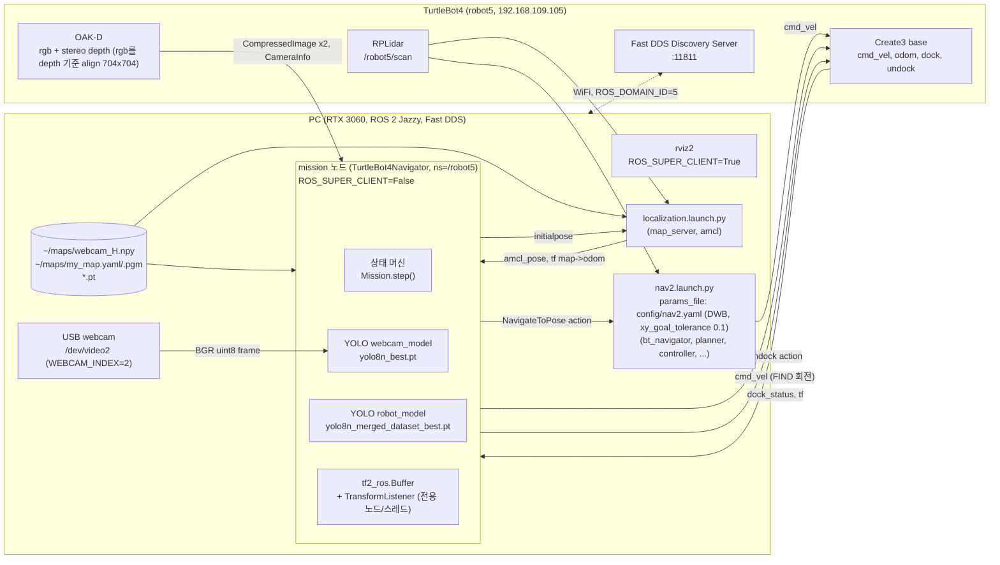
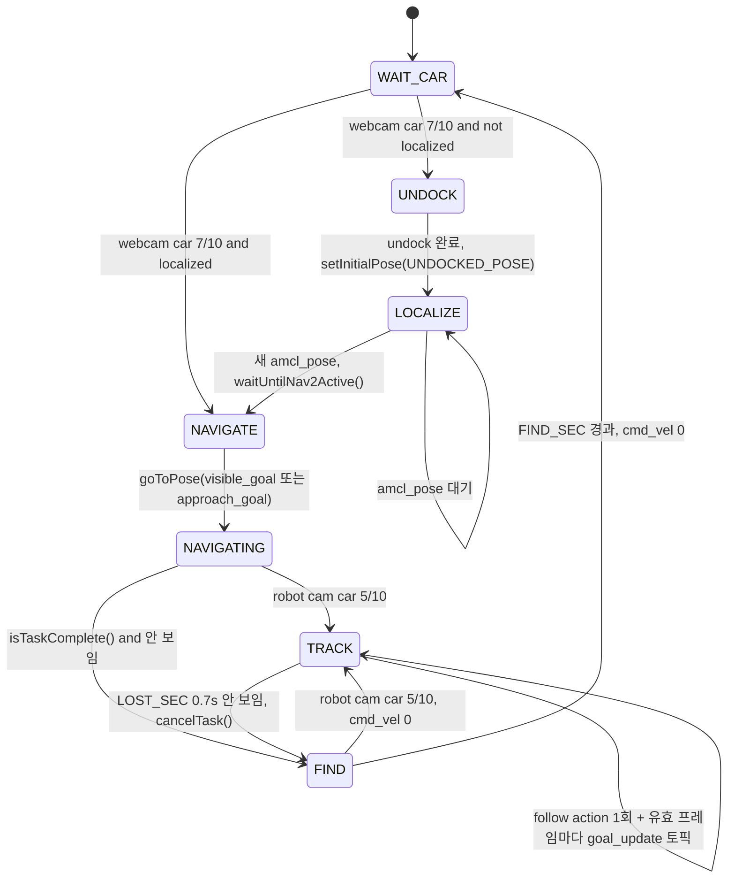
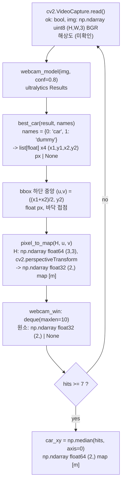
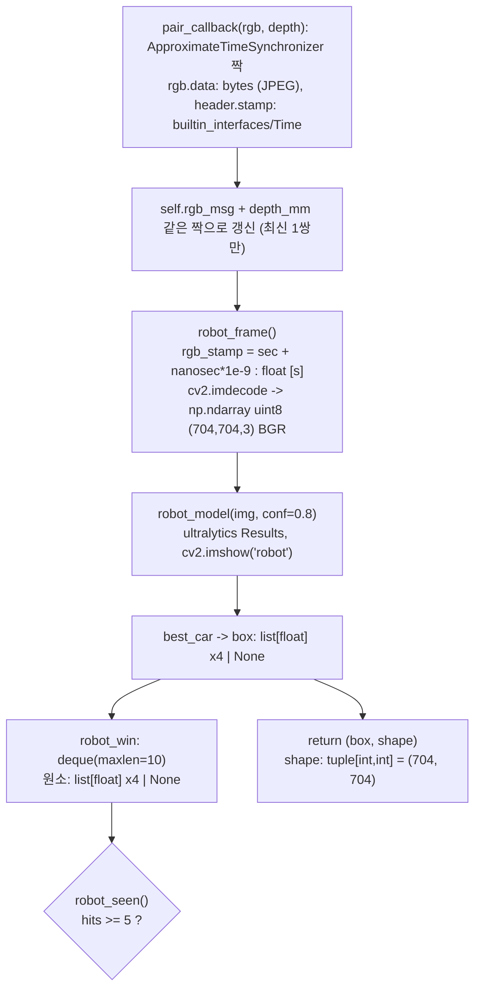
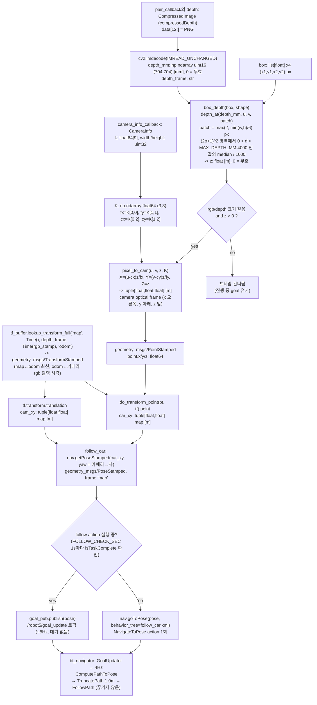
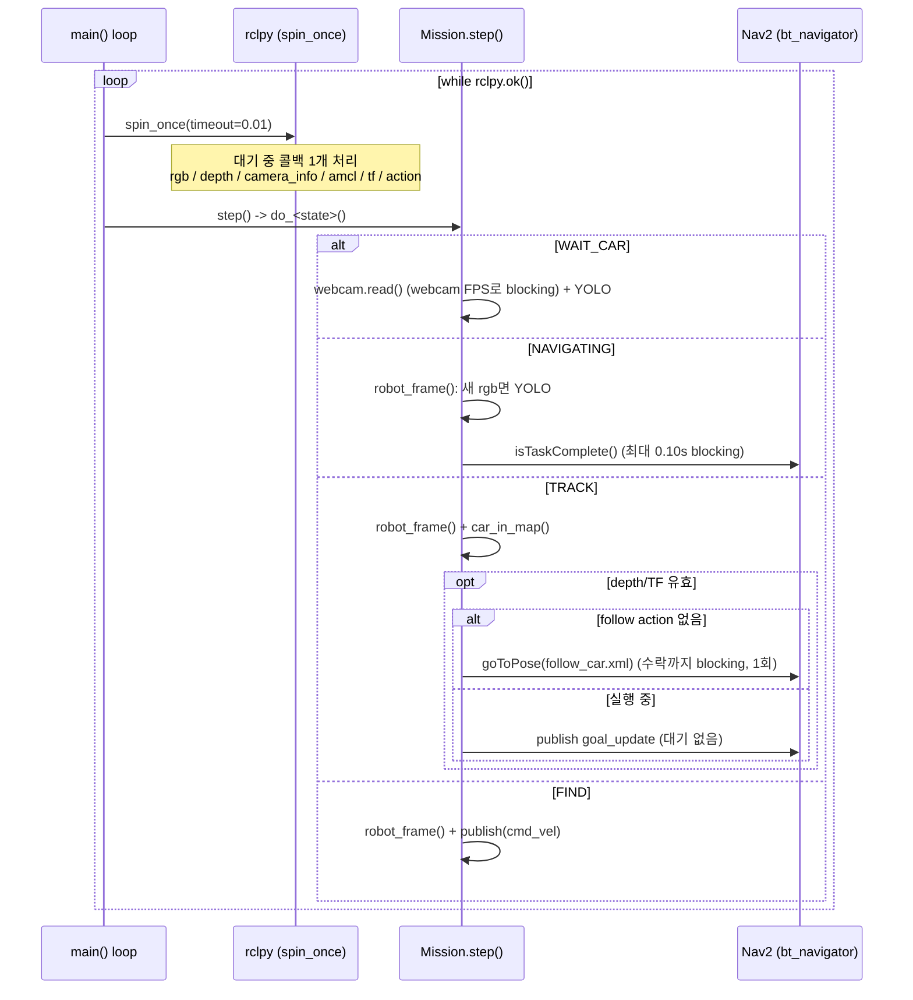
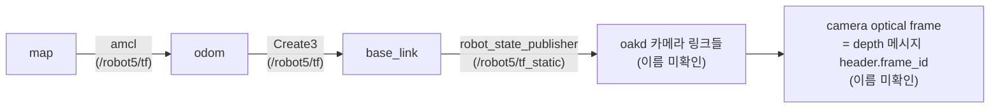

# 시스템 아키텍처

`mini_project/mission.py` 기준 (브랜치 `feature/hhj-track-gotopose`, 2026-10-07).
표기: **(미확인)** = 코드/실측으로 확인하지 않은 값. 실기에서 확인 후 갱신한다 ([10. 미확인 항목](#10-미확인-항목)).

## 1. 시스템 구성도

- 모든 노드는 로봇의 Discovery Server(`ROS_DISCOVERY_SERVER=";;;;;192.168.109.105:11811;"`)를 통해 서로를 찾는다 (`/etc/turtlebot4_discovery/setup.bash`).
- 실행 노드(localization, nav2, mission)는 `ROS_SUPER_CLIENT=False`, 확인용 CLI/rviz는 `True`. 이유는 [plan.md](plan.md) "실행 방법".
- `mission`은 노드 하나(`TurtleBot4Navigator`)에 카메라 구독, TF, Nav2 action client를 모두 붙인다. 별도 executor/thread 없음.

## 2. ROS 인터페이스 (mission 노드 기준)

이름은 모두 `/robot5` 네임스페이스. QoS 약어: `SENSOR` = `qos_profile_sensor_data` (BEST_EFFORT, VOLATILE, KEEP_LAST 5).

### 2.1 토픽

| 방향 | 토픽 | 메시지 타입 | QoS | Hz | 사용 상태 | 코드 |
|---|---|---|---|---|---|---|
| sub | `/robot5/oakd/rgb/image_raw/compressed` | `sensor_msgs/msg/CompressedImage` (JPEG) | SENSOR | 26 (실측, 도착 ~0.06s) | NAVIGATING, TRACK, FIND | `message_filters.Subscriber` → `pair_callback` |
| sub | `/robot5/oakd/stereo/image_raw/compressedDepth` | `sensor_msgs/msg/CompressedImage` (12B 헤더 + PNG, 16UC1 mm) | SENSOR | 8.2 (실측, 도착 ~0.13s) | NAVIGATING, TRACK, FIND | `message_filters.Subscriber` → `pair_callback` |
| (짝) | rgb + depth | `ApproximateTimeSynchronizer` (queue 10, slop 0.05s) | | 8.2 (실측, stamp 차이 median 1.6ms) | 로봇 카메라 처리 전체 | `pair_callback(rgb, depth)` |
| sub | `/robot5/oakd/stereo/camera_info` | `sensor_msgs/msg/CameraInfo` (704x704, rgb가 이 기준으로 align) | SENSOR | (미확인) | TRACK (K) | `camera_info_callback` |
| sub | `/robot5/map` | `nav_msgs/msg/OccupancyGrid` (0 빈칸, 100 벽, -1 unknown) | RELIABLE, TRANSIENT_LOCAL, depth 1 (`AMCL_QOS`) | 1회 (map_server) | NAVIGATE | `map_callback` |
| sub | `/robot5/amcl_pose` | `geometry_msgs/msg/PoseWithCovarianceStamped` | RELIABLE, TRANSIENT_LOCAL, depth 1 (`AMCL_QOS`) | 이동 시에만 발행 (미확인) | LOCALIZE, NAVIGATE | `amcl_callback` (+ navigator 내부 구독) |
| sub | `/robot5/dock_status` | `irobot_create_msgs/msg/DockStatus` | SENSOR | (미확인) | UNDOCK | navigator `_dockCallback` |
| sub | `/robot5/initialpose` | `geometry_msgs/msg/PoseWithCovarianceStamped` | system default | rviz 입력 시 | (navigator 내부) | navigator `_poseEstimateCallback` |
| sub | `/robot5/tf` (← `/tf` remap) | `tf2_msgs/msg/TFMessage` | tf2 기본 (RELIABLE, VOLATILE, depth 100) | (미확인) | TRACK | `TransformListener` |
| sub | `/robot5/tf_static` (← `/tf_static` remap) | `tf2_msgs/msg/TFMessage` | TRANSIENT_LOCAL | 1회 | TRACK | `TransformListener` |
| pub | `/robot5/goal_update` | `geometry_msgs/msg/PoseStamped` (frame `map`, 차 위치, yaw = 카메라→차) | depth 10 | TRACK 유효 프레임마다 (~8Hz) | TRACK | `follow_car` → bt_navigator `GoalUpdater` |
| pub | `/robot5/cmd_vel` | `geometry_msgs/msg/TwistStamped` (frame `base_link`) | RELIABLE, depth 10 | FIND 동안 루프마다 | FIND, FIND→TRACK 정지, 종료 시 정지 | `publish()` |
| pub | `/robot5/initialpose` | `geometry_msgs/msg/PoseWithCovarianceStamped` (frame `map`) | depth 10 | 1회 | UNDOCK | `nav.setInitialPose()` |

- `/tf`, `/tf_static` remap은 `main()`의 `rclpy.init(args=... '-r /tf:=/robot5/tf' ...)`. `TransformListener`가 절대 토픽 `/tf`를 구독하기 때문.
- `cmd_vel`은 Nav2 controller도 발행한다. 겹치지 않도록 FIND 진입 시 `cancelTask()` (`start_find`).

### 2.2 Action / Service (client)

| 종류 | 이름 | 타입 | 호출 | blocking |
|---|---|---|---|---|
| action | `/robot5/undock` | `irobot_create_msgs/action/Undock` | `nav.undock()` (UNDOCK) | 완료까지 (sleep 0.1s 폴링) |
| action | `/robot5/navigate_to_pose` | `nav2_msgs/action/NavigateToPose` | NAVIGATE: `nav.goToPose(PoseStamped)` / TRACK: `nav.goToPose(차 pose, behavior_tree=config/follow_car.xml)` 1회 | goal 수락까지 (`spin_until_future_complete`) |
| action | 〃 cancel | `action_msgs/srv/CancelGoal` | `nav.cancelTask()` (FIND 진입, 종료) | 취소 응답까지 |
| action | 〃 result | `NavigateToPose.Result` | `nav.isTaskComplete()` (NAVIGATING) | 최대 0.10s |
| service | `/robot5/amcl/get_state`, `/robot5/bt_navigator/get_state` | `lifecycle_msgs/srv/GetState` | `nav.waitUntilNav2Active()` (LOCALIZE) | active까지 |

## 3. 상태 머신

| 상태 | 입력 | 로봇을 움직이는 것 | 다음 상태 조건 |
|---|---|---|---|
| WAIT_CAR | webcam 프레임 | 없음 | `webcam_win`에서 car 7/10 → `car_xy` = median |
| UNDOCK | `dock_status` | Create3 undock action | 항상 LOCALIZE (도킹 아니면 경고 후 건너뜀) |
| LOCALIZE | `amcl_pose` | 없음 | `amcl_fresh` 후 `waitUntilNav2Active()` |
| NAVIGATE | `robot_xy`, `car_xy` | (goal 1회 전송) | 즉시 NAVIGATING |
| NAVIGATING | 로봇 rgb | **Nav2** (webcam 좌표 goal) | car 5/10 → TRACK, task 완료 → FIND |
| TRACK | 로봇 rgb + depth + K + TF | **Nav2** (카메라 TF 좌표 goal) | 0.7s 못 봄 → FIND |
| FIND | 로봇 rgb | **cmd_vel** 제자리 회전 `FIND_ANG * last_dir` | car 5/10 → TRACK, `FIND_SEC` → WAIT_CAR |

상태가 바뀔 때마다 `set_state()`가 `webcam_win`, `robot_win`을 비운다.

## 4. 데이터 흐름 (자료형)

### 4.1 webcam → 차 map 좌표 (WAIT_CAR)

### 4.2 로봇 카메라 → bbox (NAVIGATING / TRACK / FIND 공통)

### 4.3 bbox + depth → Nav2 goal (TRACK)

### 4.4 기타 변환

| 함수 | 입력 | 출력 | 비고 |
|---|---|---|---|
| `stamp_sec(msg)` | 메시지 (`header.stamp`) | `float` [s] | `sec + nanosec * 1e-9` |
| `hits(window)` | `deque` | `list` (None 제외) | K-of-N 판정 |
| `visible_goal(grid, res, origin, robot_xy, car_xy, radii, step_deg, clearance)` | `np.ndarray int8 (h,w)`, `float` [m/cell], `(float, float)` [m] x3, `tuple[float]` [m], `int` [deg], `float` [m] | `(x, y, yaw, r) \| None` | radii를 먼 것부터, 차 주위 반경 r 원 위 후보 중 벽/unknown과 clearance 이상 떨어지고 차까지 선분에 벽 없는 점, 로봇과 가장 가까운 것 |
| `approach_goal(robot_xy, car_xy, dist)` | `(float, float)` x2 [m], `float` [m] | `(x, y, yaw)` [m, m, rad] | 로봇→차 직선 위 차 앞 `dist` 지점. 이미 `dist` 안쪽이면 현재 위치에서 바라보기만 |
| `amcl_callback(msg)` | `PoseWithCovarianceStamped` | `robot_xy: tuple[float,float]` [m], `amcl_fresh=True` | NAVIGATE goal 계산용 |
| `publish(lin, ang)` | `float` [m/s], `float` [rad/s] | `TwistStamped` (frame `base_link`, stamp = now) | FIND 전용 |
| `nav.setInitialPose(getPoseStamped([x,y], yaw_deg))` | `UNDOCKED_POSE = (0.0, 0.0, 180.0)` | `PoseWithCovarianceStamped` (covariance 0) | UNDOCK |

## 5. 메인 루프 타이밍

- 주기 제한(timer/sleep) 없음. 처리 속도 = min(입력 Hz, 1 / (디코드 + YOLO + imshow)).
- NAVIGATING은 `isTaskComplete()` 때문에 detection이 약 9Hz 이하. TRACK은 depth 10Hz가 좌표 갱신 상한.
- `spin_once` 1회에 콜백 1개. blocking 호출(`isTaskComplete`, `goToPose`, `cancelTask`, `undock`) 안에서도 같은 노드가 spin되므로 콜백은 계속 처리된다 (최신 값만 저장).

## 6. TF 트리

- `car_in_map`은 `lookup_transform_full('map', Time(), depth_frame, rgb_stamp, 'odom')` 한 번으로 `map ← optical` 전체 체인을 얻는다.
- 시각 = bbox를 만든 rgb의 촬영 시각 (`Time(nanoseconds=rgb_stamp*1e9)`). 최신 TF(`Time()`)는 회전 중 영상 지연만큼 차 좌표가 좌우로 튀어서(실측 ±40cm) 바꿈. 과거 시각이라 대기(timeout) 없이 조회된다.
- 단 `map ← odom`은 최신 값 (`fixed_frame='odom'`). amcl의 map→odom은 약 2.8Hz에 stamp가 약 0.9s 미래(transform_tolerance)인데, 가끔 수 초씩 끊겨 rgb 시각 조회가 extrapolation으로 실패했다 (실측).

## 7. 내부 상태 변수 (`Mission`)

| 속성 | 자료형 | 단위 | 쓰는 곳 | 읽는 곳 | 의미 |
|---|---|---|---|---|---|
| `nav` | `TurtleBot4Navigator` (rclpy `Node`) | | `__init__` | 전체 | 노드 + Nav2/dock API |
| `cmd_pub` | `Publisher[TwistStamped]` | | `__init__` | `publish` | `cmd_vel` |
| `H` | `np.ndarray float64 (3,3)` | 픽셀→m | `__init__` (`webcam_H.npy`) | `do_wait_car` | webcam 바닥 homography |
| `webcam` | `cv2.VideoCapture` | | `__init__` | `do_wait_car` | BUFFERSIZE 1 |
| `webcam_model`, `robot_model` | `ultralytics.YOLO` | | `__init__` | `do_wait_car`, `robot_frame` | 클래스 `{0:'car', 1:'dummy'}` |
| `tf_buffer` | `tf2_ros.Buffer` | | `__init__` | `car_in_map` | 기본 캐시 10s |
| `tf_listener` | `tf2_ros.TransformListener` (`spin_thread=True`) | | `__init__` | | 전용 내부 노드 + 스레드에서 `/tf`, `/tf_static` 구독 (메인 루프와 무관하게 버퍼 갱신) |
| `rgb_msg` | `CompressedImage \| None` | | `pair_callback` | `robot_frame` (꺼내고 None) | 미처리 최신 짝의 rgb |
| `rgb_stamp` | `float` | s | `robot_frame` | `box_depth` | 처리 중 rgb stamp |
| `depth_mm` | `np.ndarray uint16 (704,704) \| None` | mm | `pair_callback` | `box_depth` | 최신 짝의 depth |
| `depth_frame` | `str` | | `pair_callback` | `car_in_map` | TF source frame |
| `rgb_sub`, `depth_sub`, `sync` | `message_filters.Subscriber` x2, `ApproximateTimeSynchronizer` | | `__init__` | | rgb-depth 짝 맞춤 |
| `K` | `np.ndarray float64 (3,3) \| None` | px | `camera_info_callback` | `car_in_map`, `do_track` | stereo(depth) intrinsics (rgb도 이 기준) |
| `robot_xy` | `tuple[float,float] \| None` | m (map) | `amcl_callback` | `do_navigate`, `do_navigating` 로그 | amcl 로봇 위치 |
| `amcl_fresh` | `bool` | | `amcl_callback`, `do_undock` | `do_localize` | undock 이후 amcl_pose 수신 여부 |
| `localized` | `bool` | | `do_localize` | `do_wait_car` | 한 번 위치를 잡았는지 (재진입 시 UNDOCK 생략) |
| `pose_set` | `bool` | | `do_undock` | `do_localize` 로그 | 초기 위치를 mission이 줬는지 |
| `map` | `tuple[np.ndarray int8 (h,w), float, (float, float)] \| None` | cell, m/cell, m | `map_callback` | `do_navigate` | 정적 지도 (grid, res, origin) |
| `car_xy` | `np.ndarray float64 (2,) \| None` | m (map) | `do_wait_car` | `do_navigate`, `do_navigating` 로그 | webcam 기준 차 위치 |
| `webcam_win` | `deque[np.ndarray \| None]` (maxlen 10) | m | `do_wait_car` | `do_wait_car` | K-of-N |
| `robot_win` | `deque[list[float] \| None]` (maxlen 10) | px | `robot_frame` | `robot_seen` | K-of-N |
| `raw_dist` | `float` | m | `box_depth` | `do_track` 로그 | stamp 검사 전 depth |
| `following`, `follow_check` | `bool`, `float` (`time.monotonic`) | s | `follow_car`, `set_state` | `follow_car` | TRACK follow action 실행 중 여부, 마지막 종료 확인 시각 |
| `last_seen` | `float` (`time.monotonic`) | s | `do_navigating`, `do_track`, `do_find` | `do_track` | 마지막 감지 시각 |
| `last_dir` | `float` (±1.0) | | `do_track` | `do_find` | FIND 회전 방향 (+ = 왼쪽) |
| `find_start` | `float` (`time.monotonic`) | s | `start_find` | `do_find` | FIND 시작 시각 |
| `state` | `str` | | `set_state` | `step` | `'WAIT_CAR'` ... `'FIND'` |

## 8. 설정 상수 (`mission.py` 상단)

| 상수 | 값 | 단위 | 역할 | 튜닝 |
|---|---|---|---|---|
| `NAMESPACE` | `'/robot5'` | | 로봇 네임스페이스, TF remap | |
| `MODEL_DIR` | `~/turtlebot4_ws/src/mini_project/mini_project` | | `.pt`는 install에 복사 안 됨 | |
| `WEBCAM_MODEL` | `yolo8n_best.pt` | | webcam YOLO | |
| `ROBOT_MODEL` | `yolo8n_merged_dataset_best.pt` | | 로봇 카메라 YOLO | |
| `CAR_CLASS` | `'car'` | | 감지 대상 클래스 | |
| `CONF` | 0.8 | | YOLO confidence 임계값 | O |
| `WEBCAM_N, WEBCAM_K` | 10, 7 | 프레임 | webcam 감지 판정 | O |
| `ROBOT_N, ROBOT_K` | 10, 5 | 프레임 | 로봇 카메라 감지 판정 (→ TRACK) | O (Hz에 따라 시간 길이 변함) |
| `APPROACH_DIST` | 0.5 | m | NAVIGATE goal을 webcam 기준 차 앞 몇 m에 둘지 (1.4m는 벽 너머 도착, 0.1m는 충돌 위험) | O |
| `VIS_RADII` | (1.0, 0.8, 0.6, 0.4) | m | visible_goal 후보 원 반경 (먼 것부터). 0.4 = 로봇 반경 + 차 반폭 + 여유 | O |
| `VIS_STEP_DEG` | 15 | deg | visible_goal 후보 간격 | O |
| `VIS_CLEARANCE` | 0.3 | m | visible_goal 후보 주변 벽/unknown 금지 반경 (로봇 반경 0.19 + 여유) | O |
| `TRACK_DIST` | 1.0 | m | TRACK에서 차 앞 거리 (실제 값은 follow_car.xml TruncatePath, 같게 유지), VIS_RADII 첫 반경. 카메라 0.8m 안쪽은 차가 잘림 | O |
| `FOLLOW_BT` | `~/cobot4_ws_miniproject/config/follow_car.xml` | | TRACK follow action BT (RateController 4Hz, TruncatePath 1.0m) | O (hz) |
| `FOLLOW_CHECK_SEC` | 1.0 | s | follow action 종료(실패) 확인 주기 | |
| `LOST_SEC` | 0.7 | s | 못 보면 FIND | O |
| `MAX_DEPTH_MM` | 4000 | mm | TRACK depth ROI에서 이 이상(먼 벽/배경) 제외 | O |
| `SYNC_SLOP` | 0.05 | s | rgb-depth 짝 맞춤 허용 stamp 차이 (실측 짝 차이 ≤ 31ms) | |
| `FIND_ANG` | 0.3 | rad/s | FIND 회전 속도 | O |
| `FIND_SEC` | 2π/0.3 + 1 ≈ 21.9 | s | 한 바퀴 돌아도 없으면 WAIT_CAR | |
| `UNDOCKED_POSE` | (0.0, 0.0, 180.0) | m, m, deg | undock 직후 초기 위치 (None = rviz 수동) | 도크 옮기면 재측정 |
| `WEBCAM_INDEX` (webcam_calib) | 2 | | `/dev/video2` | |
| `H_PATH` (webcam_calib) | `~/maps/webcam_H.npy` | | homography 파일 | |
| `AMCL_QOS` (webcam_calib) | RELIABLE, TRANSIENT_LOCAL, depth 1 | | `amcl_pose` 구독 QoS | |

## 9. 파일 / 외부 자원

| 파일 | 형식 | 내용 | 생성 |
|---|---|---|---|
| `src/mini_project/mini_project/yolo8n_best.pt` | ultralytics YOLOv8n | 클래스 `{0:'car', 1:'dummy'}` (webcam용) | 학습 |
| `src/mini_project/mini_project/yolo8n_merged_dataset_best.pt` | ultralytics YOLOv8n | 클래스 `{0:'car', 1:'dummy'}` (로봇 카메라용) | 학습 |
| `~/maps/webcam_H.npy` | `np.save`, float64 (3,3) | webcam 픽셀 → map (x,y) homography | `ros2 run mini_project webcam_calib` (webcam 옮길 때마다) |
| `~/maps/my_map.yaml`, `.pgm` | nav2 map_server | 점유 격자 지도 (원점 = undock 위치) | SLAM, 저장소 `maps/`에서 복사 |
| `/etc/turtlebot4_discovery/setup.bash` | shell | Discovery Server, `ROS_SUPER_CLIENT` 자동 설정 | TurtleBot4 setup |

## 10. 미확인 항목

실기에서 확인 후 이 문서의 해당 칸을 갱신한다.

- [x] `stereo/camera_info` 704x704, rgb가 depth 기준 align (사용자 확인)
- [ ] depth 메시지 `header.frame_id` — mission 시작 로그 `camera_info WxH, frame ...`
- [ ] `stereo/camera_info`의 왜곡 계수 `d` (0에 가까우면 보정 불필요)
- [ ] rgb compressed Hz, camera_info Hz, tf Hz — `ros2 topic hz` (super client 터미널)
- [ ] TF 트리 프레임 이름 — `ros2 run tf2_tools view_frames` 또는 rviz TF
- [ ] webcam 해상도
- [ ] Create3 cmd_vel timeout (FIND→TRACK 정지 명령으로 대응은 해 둠)
